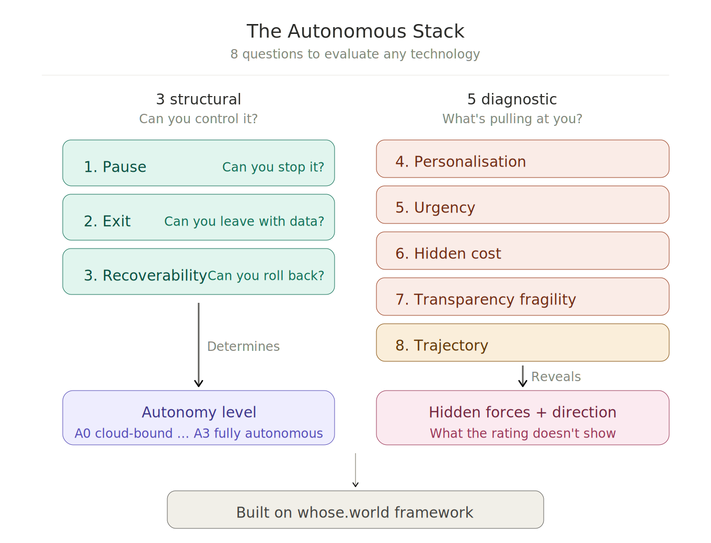

# The Autonomous Stack (TAS)

**A decision framework for building infrastructure you actually control.**

Eight questions. Open-mode architecture. Practical tools.



---

## Documentation

**[Read the full documentation](https://revenue7-eng.github.io/the-autonomous-stack/)**

- [Infrastructure Audit](https://revenue7-eng.github.io/the-autonomous-stack/docs/how-to-choose/) -- 8 questions to evaluate any technology
- [Technology Catalog](https://revenue7-eng.github.io/the-autonomous-stack/docs/catalog/) -- 28 technologies rated A0--A3
- [Recipes](https://revenue7-eng.github.io/the-autonomous-stack/docs/recipes/) -- three tested stacks: minimal server, privacy homelab, developer workstation

## Quick deploy

```bash
cd code/minimal-server
cp .env.example .env
# Edit .env with your secrets
docker compose up -d
```

## Philosophy

TAS applies the [whose.world](https://whose.world) framework to infrastructure decisions. Three structural criteria (Pause, Exit, Recoverability) and five diagnostic questions (Personalisation, Urgency, Hidden Cost, Transparency Fragility, Trajectory).

## Contributing

See [CONTRIBUTING.md](CONTRIBUTING.md).

## License

- **Code**: [MIT](LICENSE)
- **Documentation**: [CC BY-SA 4.0](https://creativecommons.org/licenses/by-sa/4.0/)
